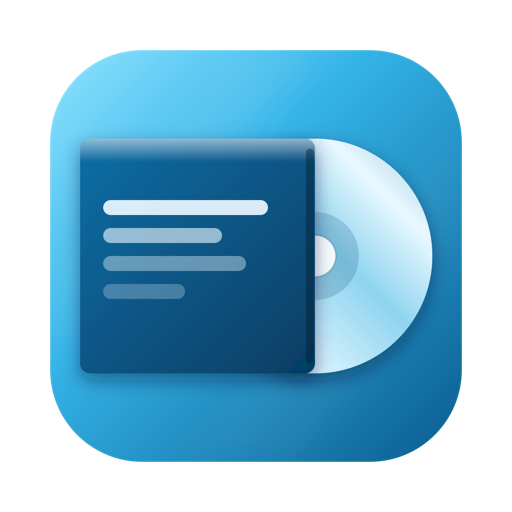

# Sleeve



A native macOS audio tagger that also converts, rips and splits. Everything revolves around one track list: ripping produces files, tagging edits them, converting turns them into something else — and the list stays put when you switch between the three modes.

The name comes from the record sleeve: the thing around the music that labels and files it. That is what Sleeve does.

## Tag

- **Batch editor** – drop in files or whole folders, edit in the table or in the inspector. With several tracks selected, fields that differ show `<Multiple values>` instead of an empty box. A field is only written if you actually touched it — an empty-looking field is never written as empty by accident.
- **Numbering** – numbers tracks in their current order, with leading zeros, track totals (03/12) and per-disc or continuous counting.
- **Capitalization** – Title Case with language-aware exceptions ("of", "the", "und", "der" …), UPPER CASE or lower case, for all fields or only chosen ones.
- **Find and replace** – "feat." to "ft.", or remove "(Remastered 2011)" everywhere at once; plain text or regular expressions with `$1`, with a preview of every change before anything happens.
- **Rename and extract** – one pattern syntax in both directions: `%track% - %artist% - %title%` turns tags into file names with a live preview, and the same pattern read backwards pulls tags out of file names. Missing tags drop their separators too, collisions get ` (2)`.
- **Cover art** – every embedded image with its type (front, back, booklet page, disc …), added by drag and drop, replaced or appended, applied to all selected tracks at once, exported as a file or `folder.jpg`.
- **Look Up Album** – finds the release on **MusicBrainz** (no account needed) or **Discogs** (with your own token) and lays its tracks next to your files, with each file's length against the release's. A file more than 3 s off is marked, so a wrong match shows up even when the titles agree. Pick which fields to take over — the front cover included, in the size you choose; nothing reaches the disk until you save.
- **Undo** – the last save can be undone. **Add to Music** hands the selection to the Music app.

## Convert

Converts to MP3, AAC, ALAC, FLAC, Opus, Vorbis, WAV and AIFF with `ffmpeg` — and writes the tags afterwards itself, cover included. Generic converters tend to lose the album artist or the disc number on the way; Sleeve reads the tags first, keeps ffmpeg's own tag copying switched off, and writes them back with TagLib. File names come from the same pattern engine as renaming.

## Rip

Reads audio CDs directly — no root, no helper tool.

- **Burst or secure mode** – secure reads every block twice, retries on a mismatch and decides by majority. Unresolved spots are named in the log.
- **Read offset**, verified to the byte, **read speed**, **C2 error pointers** where the drive delivers them, and an optional **second pass** that reads every track twice and compares checksums.
- **CD-TEXT, MCN and ISRC**, plus **Look Up…**: the MusicBrainz disc ID finds exactly this pressing; otherwise search MusicBrainz or Discogs by name. The disc's own track lengths sit next to the release's, so a wrong pressing shows before anything is taken over, and on a box set the disc in the drive is picked automatically.
- **Log and cue sheet**, any output format the Convert mode offers (WAV works without ffmpeg), file names from a pattern.

From the File menu:

- **Create Disc Image…** – the whole disc as one continuous audio stream (BIN, WAV or FLAC) plus a cue sheet. Not ISO: an audio CD carries no file system, and an ISO container would throw away an eighth of every sector.
- **Burn Image to CD…** – writes such an image back to a CD-R, session-at-once so track transitions stay gapless.
- **Copy CD…** – one button: reads the disc, ejects it, asks for a blank and burns a 1:1 copy. With two drives it reads in one and burns in the other.

With more than one optical drive, Sleeve asks which one to read from and which to burn with.

## Split Into Tracks

Splits one long recording — an album video, a vinyl side, a live set — into tracks, without re-encoding.

- Finds the pauses, cuts at the end of each one and keeps everything else, so nothing between tracks is lost. Video sources work too; only the audio is taken.
- A waveform of the whole file, two magnifiers for each track's start and end, draggable boundaries, and a player to listen across a boundary before you commit to it.
- **Look Up Titles…** – track titles from MusicBrainz, from Discogs, or from a track list pasted straight out of the video description. The list sits next to what Sleeve found, with the difference per track, and can set the boundaries itself — which finds transitions without any pause at all.
- The pieces are written as individual files with title, number, album, artist, year and genre.

## Requirements

- macOS 14 (Sonoma) or newer
- Apple Silicon
- `ffmpeg` for converting, for ripping to anything but WAV, for FLAC disc images and for splitting — see below
- Optional: a Discogs personal access token for Discogs lookups. MusicBrainz needs nothing.

## External tools

Sleeve does **not** bundle `ffmpeg`. It looks in `/opt/homebrew/bin`, `/usr/local/bin` and your `PATH`, plus any path you set in Settings, which takes precedence.

```sh
brew install ffmpeg
```

When ffmpeg is missing, the affected areas stay open and explain what to do, with the command ready to copy — Sleeve never runs an installer itself. It also checks which encoders your ffmpeg build actually has and says so before a batch starts, not after.

## Discogs token

Discogs only allows searching with a token. Create a personal access token in your Discogs account under Settings → Developers and paste it into Sleeve's Settings. It is stored in the macOS Keychain, nowhere else.

## Installation

Sleeve has not been released yet. Once it is, builds will be on the [Releases](../../releases) page.

The app will not be notarized, so macOS refuses to open it on first launch. Go to **System Settings → Privacy & Security**, scroll down to the message about Sleeve and click **Open Anyway**.

## Languages

The interface is available in **English**, **German** and **Spanish**, selected automatically from the system language. Unsupported languages fall back to English.

To try a language without changing your system settings, launch the binary directly:

```sh
Sleeve.app/Contents/MacOS/Sleeve -AppleLanguages '(es)'
```

## Known limitations

- **CD-TEXT is not burned.** Images and copies carry the audio and the track boundaries, not the titles stored on the disc.
- **No AccurateRip.** Rips are checked for repeatability (secure mode, second pass), not against other people's rips of the same pressing. The drive's read offset has to be entered by hand.
- **Copy-protected discs are refused**, not worked around. Sleeve reads standard audio CDs only — no data tracks, no DVDs.
- **Cue sheets mark track starts only.** Marking where the pause before a track begins (`INDEX 00`) would need the subchannel, which drives do not report reliably. The image itself is gapless; only the pause markers are missing.
- **Opening a disc image is not supported yet.** Sleeve writes cue sheets but cannot read them back.
- **Intel Macs are not supported.** The bundled TagLib is built for Apple Silicon only.

## Building

Requires Xcode 26 or newer (Swift 6).

```sh
open Sleeve.xcodeproj
```

Then build and run in Xcode (⌘R). TagLib is checked in as a prebuilt static library under `Vendor/taglib/`. To rebuild it from source (needs `cmake`):

```sh
Scripts/build-taglib.sh
```

Checks from the Terminal:

```sh
Scripts/run-bridge-test.sh    # tag engine, patterns, lookup, rip, burn, split — against copies of TestFiles/
Scripts/check-strings.sh      # every string in the code has a translation
```

The app is not sandboxed — required for running Homebrew's ffmpeg, which is linked against libraries a sandboxed child process may not load.

The design document, [Sleeve-SPEC.md](Sleeve-SPEC.md), explains what Sleeve does, why it does it that way, and what was measured along the way.

## Support

Sleeve is free and always will be. If it saved you some hassle, you can [buy me a coffee](https://ko-fi.com/neonrost).

## License

Copyright (C) 2026 NeonRost

This program is free software, released under the **GNU General Public License, version 3** (or, at your option, any later version). See the [LICENSE](LICENSE) file for details.

Sleeve links **TagLib** statically, used under the **GNU Lesser General Public License 2.1** (TagLib is dual-licensed LGPL 2.1 / MPL 1.1). TagLib in turn contains **utfcpp**, licensed under the **Boost Software License 1.0**. Their full texts are in [LICENSES/](LICENSES), and all three licenses are readable inside the app under **Sleeve → About Sleeve → Show License**. TagLib's source is at [github.com/taglib/taglib](https://github.com/taglib/taglib); `Scripts/build-taglib.sh` fetches and builds exactly the version Sleeve uses.
